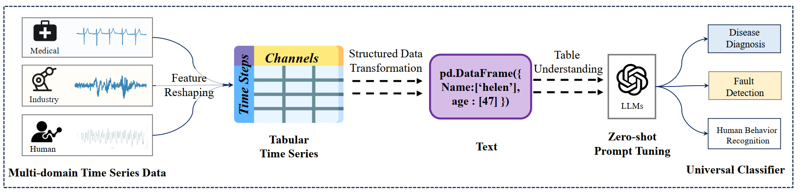

<div align="center">
  <!-- <h1><b>  </b></h1> -->
  <!-- <h2><b>  </b></h2> -->
  <h2><b> TableTime: Reformulating Time Series Classification as Training-Free Table Understanding with Large Language Models (CIKM'2025)</b></h2>
</div>

<div align="center">


</div>

<div align="center">


**[<a href="https://arxiv.org/abs/2411.15737">Paper Page</a>]**
**[<a href="https://www.themoonlight.io/en/review/tabletime-reformulating-time-series-classification-as-training-free-table-understanding-with-large-language-models">MoonLight</a>]**


**[<a href="https://mp.weixin.qq.com/s/7TTO8osQED9yqQ70s9Ruxw">时序人中文解读</a>]**
**[<a href="https://mp.weixin.qq.com/s/CnFpm-fuplmDEcKmC_pMGA">AI科研技术派中文解读</a>]**


</div>

---
> 👏 The paper is accpeted by CIKM 2025!
>
> 🙋 Please let us know if you find out a mistake or have any suggestions!
> 
> 🌟 If you find this resource helpful, please consider to star this repository and cite our research:

```bibtex
@article{wang2024tabletime,
  title={Tabletime: Reformulating time series classification as zero-shot table understanding via large language models},
  author={Wang, Jiahao and Cheng, Mingyue and Mao, Qingyang and Liu, Qi and Xu, Feiyang and Li, Xin and Chen, Enhong},
  journal={arXiv e-prints},
  pages={arXiv--2411},
  year={2024}
}
```
## Motivation

In today’s data-driven world, multivariate time series (MTS) are essential in areas like healthcare, industrial monitoring, and behavior recognition. Traditional time series classification (TSC) methods struggle to capture temporal dependencies and multi-channel patterns, while deep learning models, despite their strong performance, are often complex and opaque.

Large language models (LLMs) offer powerful reasoning and cross-domain generalization, but applying them directly to TSC is hindered by data–text mismatches, high costs, and underutilized reasoning ability. To address these issues, we propose **TableTime**, a framework that reformulates MTS classification as a table comprehension task, enabling LLMs to better exploit their reasoning power and offering a new paradigm for time series analysis.

<center></center>

## Method

## Experimental Result

## How to run the code

## Further Reading
1, [****Can Slow-thinking LLMs Reason Over Time? Empirical Studies in Time Series Forecasting**](https://arxiv.org/abs/2505.24511)

**Authors**: Cheng, Mingyue and Wang, Jiahao and Wang, Daoyu and Tao, Xiaoyu and Liu, Qi

```bibtex
@article{wang2025can,
  title={Can slow-thinking llms reason over time? empirical studies in time series forecasting},
  author={Wang, Jiahao and Cheng, Mingyue and Liu, Qi},
  journal={arXiv preprint arXiv:2505.24511},
  year={2025}
}
```

2, [**FormerTime: Hierarchical Multi-Scale Representations for Multivariate Time Series Classification**](https://arxiv.org/pdf/2302.09818).

**Authors**: Cheng, Mingyue and Liu, Qi and Liu, Zhiding and Li, Zhi and Luo, Yucong and Chen, Enhong

```bibtex
@inproceedings{cheng2023formertime,
  title={Formertime: Hierarchical multi-scale representations for multivariate time series classification},
  author={Cheng, Mingyue and Liu, Qi and Liu, Zhiding and Li, Zhi and Luo, Yucong and Chen, Enhong},
  booktitle={Proceedings of the ACM Web Conference 2023},
  pages={1437--1445},
  year={2023}
}
```

3, [**InstructTime: Advancing Time Series Classification with Multimodal Language Modeling**](https://arxiv.org/pdf/2403.12371).

**Authors**: Cheng, Mingyue and Chen, Yiheng and Liu, Qi and Liu, Zhiding and Luo, Yucong

```bibtex
@article{cheng2024advancing,
  title={Advancing Time Series Classification with Multimodal Language Modeling},
  author={Cheng, Mingyue and Chen, Yiheng and Liu, Qi and Liu, Zhiding and Luo, Yucong},
  journal={arXiv preprint arXiv:2403.12371},
  year={2024}
}
```

4, [**TimeMAE: Self-supervised Representation of Time Series with Decoupled Masked Autoencoders**](https://arxiv.org/pdf/2303.00320).

**Authors**: Cheng, Mingyue and Liu, Qi and Liu, Zhiding and Zhang, Hao and Zhang, Rujiao and Chen, Enhong

```bibtex
@article{cheng2023timemae,
  title={Timemae: Self-supervised representations of time series with decoupled masked autoencoders},
  author={Cheng, Mingyue and Liu, Qi and Liu, Zhiding and Zhang, Hao and Zhang, Rujiao and Chen, Enhong},
  journal={arXiv preprint arXiv:2303.00320},
  year={2023}
}
```

5, [**CrossTimeNet: Learning Transferable Time Series Classifier with Cross-Domain Pre-training from Language Model**](https://arxiv.org/pdf/2403.12372).

**Authors**: Cheng, Mingyue and Tao, Xiaoyu and Liu, Qi and Zhang, Hao and Chen, Yiheng and Lei, Chenyi

```bibtex
@article{cheng2024learning,
  title={Learning Transferable Time Series Classifier with Cross-Domain Pre-training from Language Model},
  author={Cheng, Mingyue and Tao, Xiaoyu and Liu, Qi and Zhang, Hao and Chen, Yiheng and Lei, Chenyi},
  journal={arXiv preprint arXiv:2403.12372},
  year={2024}
}
```


